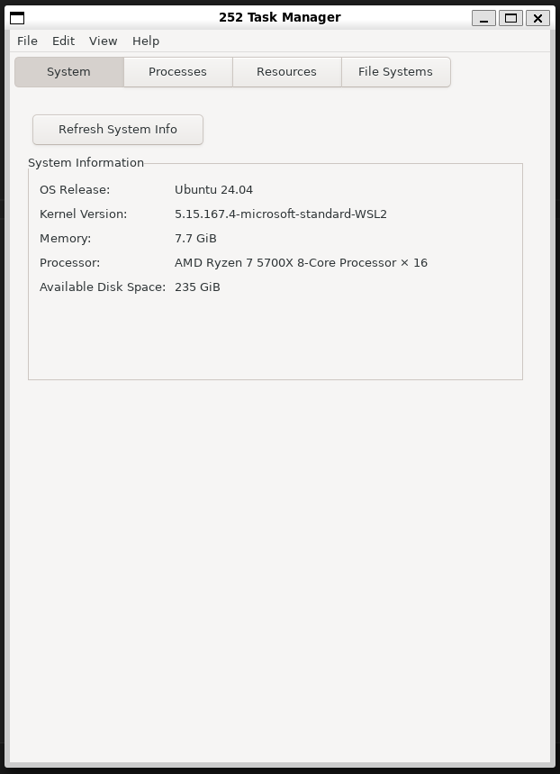
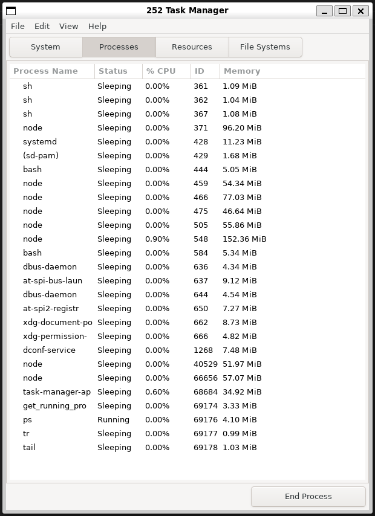
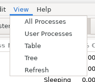
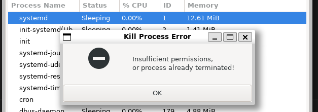
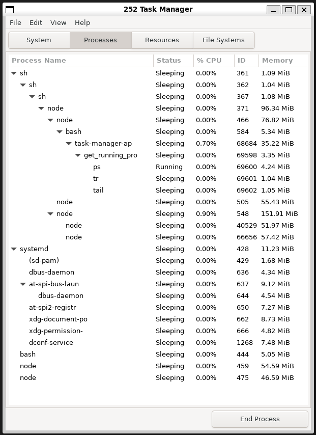
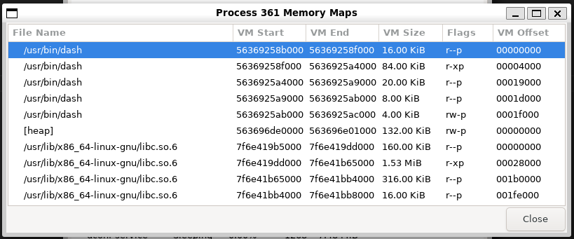
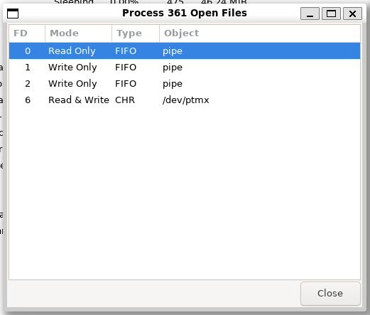
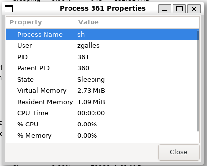
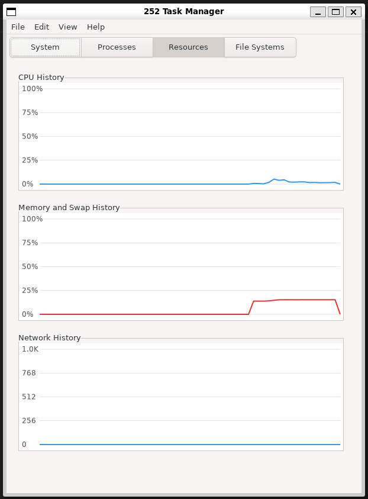
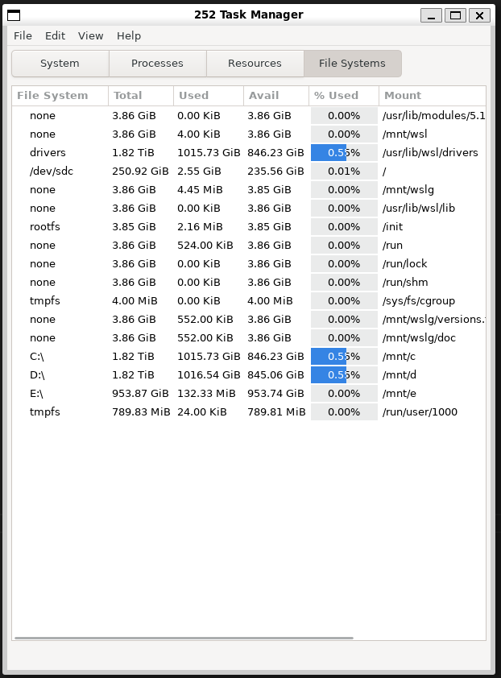

# Group 27 Project 6
#### Group members:
```
Zachary Galles (zgalles@purdue.edu)
Daksh Guard (guardd@purdue.edu)
Dakota Baldwin (baldwi71@purdue.edu)
Liam Gallagher (lmgallag@purdue.edu)
```
# System Page
#### Key Features:
* Displays system information
## System Page Showcase


# Processes Page
#### Key Features:
* Various view options under the `View` menu (Tree, Table, All, User, Refresh)
* Right click a process to see process specific actions
* Error handling with modal dialogs
* Columns auto-sort when column headers are clicked (same for the process-specific action dialogs, and they don't just sort lexicographically unless it makes sense for it to!)
## Process Page Showcase

### View menu

### Error handling

### Tree view

### Memory Maps

### Open Files

### Process Properties


# Resources Page
#### Key Features:
* Displays usage graphs for CPU, Memory & Swap History, and Network
## Resource Page Showcase


# File Systems Page
#### Key Features:
* Displays information about system mounts
* Displays usage as a progress bar & percentage
* Columns auto-sort when the header is clicked
## File Systems Page Showcase

